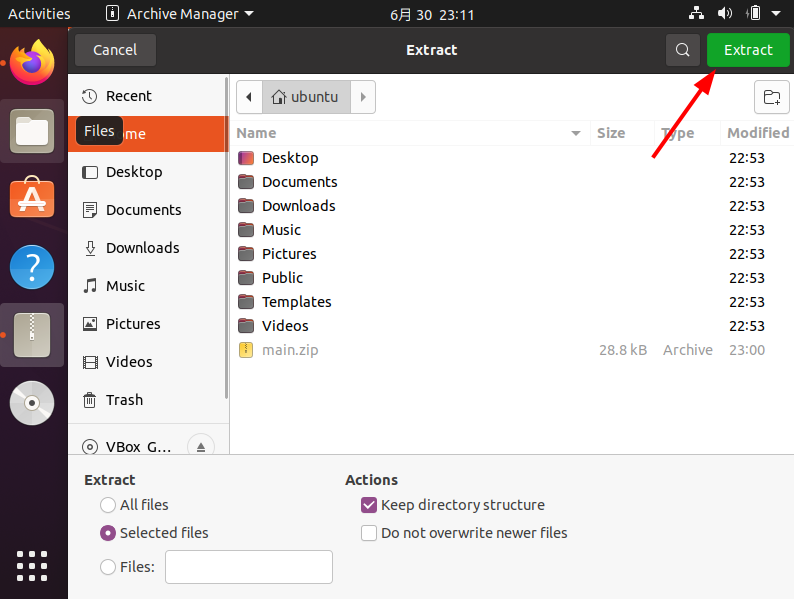
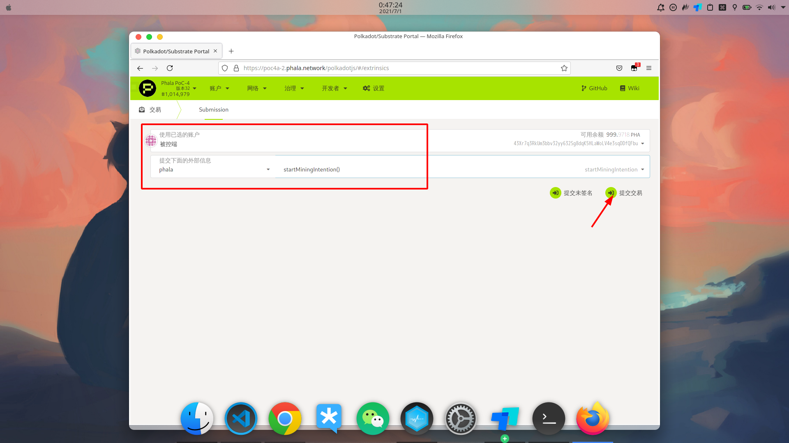

# Phala 挖矿教程
>本文不是官方教程，而是结合个人经验、针对[官方教程](https://www.yuque.com/phala/mining)的重新梳理

## 挖矿准备

Pha 挖矿需要三部分

1. 矿机用于挖矿
    * 矿机主要 Intel 6 代 U 以上
    * 主板支持 SGX (英特尔®软件防护扩展)
    * 硬盘空间 100G 以上
    * 运行 Ubuntu 18.04/20.04 操作系统 **(仅支持这两个版本)**

2. 网站负责操作
    * 注册帐号，获取助记词: 助记词是私钥
    * 获取种子: 种子是帐号的备份文件，当更换浏览器/电脑，必须使用「种子 + 帐号的密码」才能恢复
    * 调整矿机状态: 开始/停止挖矿、产生交易等
    * 查询信息: 当前矿池人数、当前收益等

3. 凡是关于挖矿，都需要连接国外服务器，需要先翻墙

<!-- pagebreak -->

## 本文大纲

@import "./01_01.png" {width="150%" higth="150%"}

<!-- pagebreak -->

## 网站操作一
> PHA 目前一台矿机需要两个帐号，一个作为被控端，一个作为控制端，两个帐号之间需要设定绑定关系

#### 注册帐号

1. 打开[网站](https://poc4.phala.network/polkadotjs/#/accounts) 或 [备用网站](https://poc4a-2.phala.network/polkadotjs/#/accounts)
        

2. 添加账户
    * 点击添加账户
    * 点击按钮复制助记词，保存到安全的位置，这里推荐[幕布](https://www.mubu.com)
    * 点击提示框`i have save my mnemonic seed safely (我安全保存了助记词)`
    * 点击`Next (下一步)`
        
        

3. 设置帐号和密码
    * 输入想要的帐号和密码
    * 点击 Next
        

4. 下载种子
    * 点击保存
    * 种子的默认名字是`帐号地址+.json` 为了便于区分，建议将种子重命名为，例如`被控端.json`
        
        

5. 重复流程，注册控制端帐号

6. 最后成果如下
    * 网站上有两个帐号
        
    * 保存了两个助记词
        
    * 保存了两个种子
        

#### 申请测试币
> PHA 的每笔操作都需要支付相应的 PHA 币，测试网阶段可以先获取测试币，免除质押

1. 申请测试币需要在 TG(Telegram) 聊天软件上加入 [PHA 测试币群](https://t.me/phalafaucet)
    * [TG 的注册教程](https://blog.gugemi.com/35.html)
    * [TG 的使用教程](https://ssrvps.org/archives/10319)

2. 复制帐号地址
    * 在网站上点击账户
    * 账户菜单上点击头像，账户的地址就会复制到剪贴板
        
3. 申请测试币
   
    * 在 PHA 测试币群中发送以下格式
``` shell
# /drip 账户地址，如

/drip 43Xr7q3RkUm3bbv32yy632Sg8dqK5HLaWoLV4e3sqDDfQFbu
/drip 44qaBSuahs34nYNZBbC4MhPUSS55uJFjLAVfQC6P7end5Hgk
``` 
   
   * 当收到机器人如图回复后，代表收到测试币，网站上账户余额也会发生变化
    @import "./02_02.png" { higth="600" width="300" title="图片的标题" alt="我的 alt"}
    

#### 设置绑定关系

1. 网站顶栏「开发者 => 交易」
    
2. 设置的信息如图，点击交易
    
3. 输入密码，支付测试币
    

<!-- pagebreak -->

## 矿机操作

> 矿机需要安装 Ubuntu、并且对 Bios 设置项做调整。
> 不同厂家、同厂家不同型号的 Bios 设置项不尽相同，以下教程以 `HP ProDesk 480G4` 为例。
> 如果不清楚建议百度机型+进入 Bios，或者寻求厂家支持

#### Ubuntu 安装

[教程](https://www.jianshu.com/p/54d9a3a695cc)

#### 适用于 Phala 挖矿的 Bios 调整

1. 关闭安全启动 (Secure Boot) 和传统引导 (Legacy Boot)
        
2. 开启 SGX，将选项定义为`enable`[^1][^2]
   * 在一些主板上 (如飞行堡垒)，SGX 为隐性特性，即主板支持，但 Bios 没有该项，也就是`Software Control`，可以在下文`启用 SGX` 一节手动开启
        

#### 打开终端的方法(常用，终端是执行命令的软件)


#### 下载并解压 PHA 挖矿程序的压缩包

1. 终端下载

``` shell
wget https://github.com/Phala-Network/solo-mining-scripts/archive/main.zip  # 下载脚本
unzip main.zip  # 解压脚本
```

   
   
2. 浏览器直接访问[链接](https://github.com/Phala-Network/solo-mining-scripts/archive/main.zip)下载
   
    
    
    
    

#### 安装 PHA 挖矿脚本

1. 进入脚本的目录

``` shell
ls        # 查看当前目录下的文件，应该看到 solo-mining-scripts-main 目录
cd solo*  # 进入脚本目录
ls        # 查看脚本目录下的文件
```
   
2. 启用 SGX[^1][^2]
``` shell
sudo ./sgx_enable  # 启用 SGX
```

   
3. 安装 PHA 挖矿脚本

``` shell   
sudo ./install.sh cn  # 安装中文版本的 phala 挖矿脚本
```


#### 加入波卡网络(同步数据)

1. 查看 IP 的方法
   * 终端
    ``` shell
    ip a
    ```
    
      
   * 图形界面
        
        
        

2. 自动安装 phala
``` shell
    sudo phala install init  
    # 自动安装所需驱动、提示用户输入信息
    # 节点名字随意、IP 地址填局域网的IP、助记词要填控制端的助记词
```
      


      
3. SGX 测试[^5]
``` shell
sudo phala sgx-test

# 解读
✔  CPU support // 这里如果是❌，就不要试了CPU完全不支持
✔  CPU configuration // 这里如果是❌，BIOS太老了，找主板厂
✔  Enclave attributes // 这里如果是❌前两项应该也是❌先解决上面的问题
✔  Enclave Page Cache // 这里如果是❌前两项应该也是❌先解决上面的问题
SGX features
✘  SGX2  ✘  EXINFO  ✘  ENCLV  ✘  OVERSUB  ✘  KSS // 目前SGX2和EXINFO没用到所以这里为❌不影响。
Total EPC size: 94.0MiB // 这里如果是❌先可以忽略
✘  Flexible launch control
✔  CPU support
✘  CPU configuration // 这里如果是❌或者❓今后有一定的概率挖不了（半年内不影响），但短时间内不受影响
✔  SGX system software
✔  SGX kernel device (/dev/isgx)
✔  libsgx_enclave_common
✔  AESM service
✔  Able to launch enclaves
✔  Debug mode
✘  Production mode // 这里如果是❌，请尽量升级，但如果下面一行是✅那就暂时可以挖矿（半年内）
✔  Production mode (Intel whitelisted) // 这里如果是❌，那就不能用

advisoryIDs = "INTEL-SA-00289", "INTEL-SA-00334"  // 已经检测到的漏洞
confidenceLevel = 4  // 信任分级
```


4. 开始同步[^3]
``` shell
sudo phala start
```   

5. 同步完成
``` shell
sudo phala status  # 查看容器运行状态
```


<!-- pagebreak -->

## 网站操作二
> 矿机同步完数据，仅仅是加入了波卡网络，不会自动挖矿，需要在网站手动开启

1. 在网站的「开发者 => 链状态」可以看到矿机状态为 `free,null`[^4]，代表加入了波卡网络，但是没有开始挖矿
    
2. 在网站「开发者 => 交易」，设置如图，点击提交开始挖矿
    
3. 在网站的「开发者 => 链状态」，设置如下，可以查看当前的收益
    
4. 点击「账户的侧栏 => 忘记这个帐号」，可以删除账户
    
    
    
    
5. 点击「恢复 Json => 输入密码」可以使用种子恢复帐号
    
    
    

<!-- pagebreak -->

## 经验之谈

[^1]: ##### SGX 的返回值分析

    |返回值|含义|
    |:---:|:---:|
    |Intel SGX is already enabled on this system|SGX 已启用，可以进行下一步|
    |Software enable has been set. Please reboot your system to finish|Bios 中 SGX 的设置为 Software Control，需要重启以应用 SGX|
    |This CPU does not support Intel SGX|CPU 不支持 SGX，无法挖矿|

    
    
    

[^2]: ##### SGX 驱动不存在问题

    - 检查 SGX 驱动是否存在
    ``` shell
    ls /dev | grep sgx
    # 返回值为 sgx、sgx_enclave、sgx_provision 说明 SGX 驱动存在，是 8 代 U 以上的 DCAP 驱动
    # 返回值为 isgx，说明 SGX 驱动存在，是 6 代 U 以上的 isgx 驱动
    # 无返回值，说明没有 SGX 驱动
    ```

    - SGX 驱动丢失问题: SGX 驱动以内核模块的形式存在，因为是用户添加，当内核更新时，模块不会自动添加，执行以下命令手动下载
    ``` shell
    sudo phala install dcap || sudo phala install isgx
    ```

[^3]: ##### 同步问题
    - pha 挖矿实际上是依次运行三个 docker 容器: node、pruntime、phost，因此可以从 Linux、docker 的角度解决问题
    - 例如通过同步的数据量估算同步的进度
    ``` shell
    sudo du -sh /root/phala-node-data/
    ```

    - 很多时候矿机并不能完美接入波卡网络，需要手动排查，输入以下命令查看矿机状态
    ``` shell
    sudo phala status  # 以 phala 的方式查看容器运行状态
    sudo docker ps -a  # 以 docker 的方式查看容器运行状态
    ```

    - 当某个容器没有被唤醒时，可以手动唤醒
    ``` shell
    sudo phala start node
    sudo phala start pruntime
    sudo phala start phost
    ```
    
    - 当某个容器始终无法被唤醒时，可以通过 `debug` 参数查看日志
    ``` shell
    sudo phala start node debug
    sudo phala start pruntime debug
    sudo phala start phost debug
    ```
    |常见报错|含义|解决方案|
    |:---:|:---:|:---:|
    |Bad privkey derive path|助记词填写错误，重设助记词|sudo phala stop;sudo phala config set;sudo phala start|
    |Failed to decode signature|区块没同步完或者节点有错，检查是否同步完最高区块|等待同步完成或更新脚本|sudo phala update clean|
    |FailedToCallRegisterWorker|无法加入波卡网络|检查 node 是否同步完成、检查 sgx 是否存在、重开 pruntime|
    |No genesis block|node 镜像版本错误，需要升级|命令: sudo phala update clean|

[^4]: ##### 链状态信息解读

    |链状态|含义|
    |:---:|:---:|
    |"Empty": null|矿机没有加入波卡网络，检查是否同步完成|
    |"Free": null| 矿机加入了波卡网络，但是没有开始挖矿|
    |"MiningPending": null|矿机在下个区块开始挖矿|
    |"Mining": "BlockNumber"|矿机正在挖矿，后面的数字是目前的区块高度|
    |"MiningStopping": null|矿机在下个区块结束挖矿，强行退出将接受惩罚|

[^5]: ##### 提升信任评级的办法

    - 查看信任评级
    ``` shell
    sudo phala sgx-test  # confidenceLevel = 4 表示四级设备
    ```
    
    - 信任分级的原理: 
        * Phala 援引 Intel 的 IAS 认证来做信任评级，从高到底共 1-5 级
        * 1 级表示没有任何已知漏洞、2、3 级有部分白名单漏洞，但是可以与 1 级一样做高收益任务
        * 4 级表示有白名单以外的漏洞且目前无法修复，5 级除了漏洞以外微码过旧，4、5 级只能运行低收益任务
    - 提升评级:
        * phala 评级的漏洞主要来自于底层硬件，无法从系统角度修补，1-3 级几乎无法提升
        * 5 级主要是微码过旧，更新 Bios 可以提升到 4 级
        
